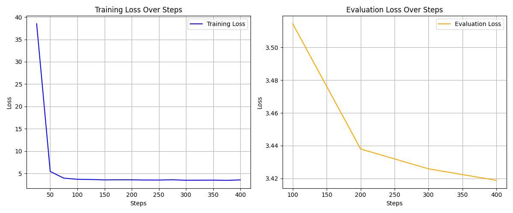

# LoRA-Tune: Efficient Quantized Language Model Adaptation

## **Accelerating Domain-Specific LLM Fine-tuning with QLoRA**

[](https://opensource.org/licenses/MIT)
[](https://www.python.org/)
[](https://pytorch.org/)
[](https://huggingface.co/docs/transformers/index)
[](https://github.com/huggingface/peft)
[](https://github.com/TimDettmers/bitsandbytes)

---

## Table of Contents

* [1. Project Overview](#1-project-overview)
* [2. Core Features](#2-core-features)
* [3. Technical Architecture](#3-technical-architecture)
* [4. Technologies and Methodologies](#4-technologies-and-methodologies)
* [5. Installation and Setup](#5-installation-and-setup)
    * [5.1 Prerequisites](#51-prerequisites)
    * [5.2 Environment Setup](#52-environment-setup)
    * [5.3 Running Training](#53-running-training)
    * [5.4 Running Inference (Loading Saved Model)](#54-running-inference-loading-saved-model)
* [6. Usage Guide](#6-usage-guide)
* [7. Results and Performance](#7-results-and-performance)
* [8. Roadmap and Future Enhancements](#8-roadmap-and-future-enhancements)
* [9. Contributing Guidelines](#9-contributing-guidelines)
* [10. License](#10-license)
* [11. Contact and Support](#11-contact-and-support)

---

## 1. Project Overview

**LoRA-Tune** is a lightweight yet powerful framework designed for the efficient fine-tuning of Large Language Models (LLMs) on custom datasets. It leverages **QLoRA (Quantized Low-Rank Adaptation)**, an advanced technique that combines 4-bit quantization of the base LLM with the Parameter-Efficient Fine-Tuning (PEFT) method known as LoRA. This synergistic approach drastically reduces GPU memory consumption and accelerates the training process, making LLM adaptation accessible on more constrained hardware while maintaining high performance.

This project addresses the challenges of high computational cost and memory requirements traditionally associated with fine-tuning large-scale Transformer models. By providing a streamlined workflow for QLoRA, LoRA-Tune enables researchers and developers to rapidly adapt pre-trained LLMs to specific domains, generate specialized text, or imbue models with new knowledge from bespoke datasets.

**Problem Solved:** Full fine-tuning of multi-billion parameter LLMs demands significant computational resources (high-end GPUs, large memory). LoRA-Tune mitigates this by making it feasible to fine-tune powerful LLMs on more modest hardware (e.g., a single consumer GPU) by reducing memory footprint by up to 3x compared to 16-bit fine-tuning.

**Unique Value Proposition:**
* **Memory Efficiency:** 4-bit quantization with `bitsandbytes` significantly reduces VRAM usage.
* **Rapid Adaptation:** LoRA fine-tuning trains only a small fraction of the model's parameters, leading to much faster convergence.
* **Performance Retention:** Despite quantization and parameter efficiency, LoRA-Tune aims to preserve or even enhance the base model's performance on the target task.
* **Simplified Workflow:** Integrates seamlessly with Hugging Face Transformers and Datasets, providing an intuitive training pipeline.

---

## 2. Core Features

* **QLoRA Implementation:** Seamless integration of 4-bit quantization (`bitsandbytes`) with LoRA (`peft`) for efficient fine-tuning.
* **Flexible Model Loading:** Supports loading various causal language models from the Hugging Face Hub.
* **Custom Dataset Support:** Easily adaptable to custom text datasets in JSON or other formats compatible with Hugging Face `datasets`.
* **Automated Data Preparation:** Handles tokenization, padding, and label creation for causal language modeling tasks.
* **Hugging Face `Trainer` Integration:** Utilizes the robust `Trainer` class for managing the fine-tuning loop, including logging, evaluation, and checkpointing.
* **LoRA Adapter Management:** Saves only the small LoRA adapters, allowing for easy storage and deployment.
* **Optional Model Merging:** Provides functionality to merge the LoRA adapters back into the base model, creating a single, portable fine-tuned model.
* **Inference Capability:** Demonstrates text generation using the fine-tuned model.
* **Training Metric Visualization:** Generates plots of training and evaluation loss for performance monitoring.
* **Training Resumption:** Automatically detects and resumes training from the latest checkpoint if the process is interrupted.

---

## 3. Technical Architecture

LoRA-Tune operates as a single-script framework, orchestrating various components from the Hugging Face ecosystem and related libraries to achieve efficient LLM fine-tuning.

+------------------------------------+
|                                    |
|         LoRA-Tune Framework        |
|                                    |
+------------------------+-----------+
| 1. Model & Tokenizer   |
|    Loading             |
|    (Hugging Face)      |<--- Pre-trained LLM (e.g., distilgpt2)
+------------------------+-----------+
| 2. 4-bit Quantization  |
|    (bitsandbytes)      |
+------------------------+-----------+
| 3. PEFT (LoRA) Layer   |
|    Insertion           |
|    (PEFT Library)      |
+------------------------+-----------+
| 4. Dataset Loading &   |
|    Preprocessing       |<--- Custom Text Dataset (e.g., English Quotes)
|    (Hugging Face Datasets) |
+------------------------+-----------+
| 5. Training Loop       |
|    (Hugging Face Trainer)|
|    - Gradient Checkpointing |
|    - Paged Optimizers   |
|    - Checkpoint Resumption|
+------------------------+-----------+
| 6. Model & Adapter     |
|    Saving              |
|    - LoRA Adapters      |
|    - Optional Merged Model |
+------------------------+-----------+
| 7. Inference & Text    |
|    Generation          |
+------------------------+-----------+
| 8. Metrics Plotting    |
|    (Matplotlib)        |
+------------------------+-----------+


**Key Components & Data Flow:**

1.  **Base Model & Tokenizer:** A pre-trained causal language model (e.g., `distilgpt2`) and its corresponding tokenizer are loaded from the Hugging Face Hub.

2.  **Quantization:** The base model's weights are quantized to 4-bit precision, significantly reducing memory footprint without substantial performance degradation.

3.  **LoRA Adapters:** Small, trainable low-rank matrices are injected into the model's key layers (e.g., attention and projection matrices).

4.  **Dataset Processing:** Raw text data is loaded, tokenized, and formatted into `input_ids` and `labels` suitable for causal language modeling.

5.  **Training:** The `Trainer` orchestrates the fine-tuning process, utilizing techniques like gradient accumulation, `paged_adamw_8bit` optimizer for memory efficiency, and supports resuming from saved checkpoints.

6.  **Saving:** After training, the lightweight LoRA adapters are saved. Optionally, these adapters can be merged with the original 4-bit base model to create a full, fine-tuned model.

7.  **Inference:** The fine-tuned model (or the base model + loaded adapters) is used to generate text based on provided prompts.

8.  **Visualization:** Training and evaluation losses are plotted to provide insights into the model's learning progress.

---

## 4. Technologies and Methodologies

* **Programming Language:** Python 3.9+

* **Deep Learning Framework:** [PyTorch 2.x](https://pytorch.org/)

* **LLM Frameworks:**

    * [Hugging Face Transformers](https://huggingface.co/docs/transformers/index) (for model and tokenizer management, `Trainer`)

    * [PEFT (Parameter-Efficient Fine-tuning)](https://github.com/huggingface/peft) (for LoRA implementation)

    * [bitsandbytes](https://github.com/TimDettmers/bitsandbytes) (for 4-bit quantization)

* **Data Handling:** [Hugging Face `datasets`](https://huggingface.co/docs/datasets/index) (for efficient dataset loading and preprocessing)

* **Numerical Operations:** [NumPy](https://numpy.org/)

* **Plotting:** [Matplotlib](https://matplotlib.org/)

* **Best Practices:**

    * **QLoRA:** Efficient fine-tuning for large models.

    * **Gradient Checkpointing:** Reduces memory usage during training by recomputing intermediate activations.

    * **Paged Optimizers:** Optimizers (like `paged_adamw_8bit`) that manage memory more efficiently, crucial for large models.

    * **Reproducibility & Resumption:** Supports resuming training from the last checkpoint.

    * **Modularity:** Code organized into logical functions and blocks.

---

## 5. Installation and Setup

This section outlines how to set up and run the LoRA-Tune framework. A GPU (NVIDIA preferred with CUDA) is highly recommended for efficient training.

### 5.1 Prerequisites

* **Git:** For cloning the repository.

    ```bash
    # For Debian/Ubuntu
    sudo apt-get install git

    # For macOS with Homebrew
    brew install git

    # For Windows, download from [https://git-scm.com/download/win](https://git-scm.com/download/win)

    ```

* **Python 3.9+:**

    * Download from [python.org](https://www.python.org/downloads/).

    * Verify installation: `python3 --version`

* **CUDA Toolkit (NVIDIA GPUs):**

    * Required for `bitsandbytes` and GPU acceleration. Ensure it's compatible with your PyTorch version.

    * Follow NVIDIA's official installation guide: [CUDA Toolkit Downloads](https://developer.nvidia.com/cuda-downloads)

### 5.2 Environment Setup

1.  **Clone the Repository:**

    ```bash
    git clone [https://github.com/Ayushman125/LoRA-Tune.git](https://github.com/Ayushman125/LoRA-Tune.git)
    cd LoRA-Tune

    ```

2.  **Create and Activate a Virtual Environment:**
    It is highly recommended to use a virtual environment to manage dependencies.

    ```bash
    python -m venv venv
    venv\Scripts\activate  # On Windows
    # source venv/bin/activate  # On Linux/macOS

    ```

3.  **Install Required Libraries:**
    Install all necessary Python packages. Adjust `torch` version and `cu` (CUDA) version (`cu118`, `cu121`, etc.) to match your system's CUDA installation.

    ```bash
    pip install torch==2.2.0 torchvision==0.17.0 torchaudio==2.2.0 --index-url [https://download.pytorch.org/whl/cu118](https://download.pytorch.org/whl/cu118)
    pip install transformers peft bitsandbytes datasets matplotlib

    ```

    *Note: Always ensure your PyTorch version and CUDA toolkit match for optimal GPU performance. If you encounter `bitsandbytes` installation issues, refer to its official GitHub for specific troubleshooting.*

### 5.3 Running Training

To fine-tune a model on the specified dataset (or resume from a checkpoint):

1.  **Ensure `LOAD_MODEL_FOR_INFERENCE_ONLY` is `False`:**
    Open `main_finetuning_script.py` and set:

    ```python
    LOAD_MODEL_FOR_INFERENCE_ONLY = False

    ```

2.  **Execute the script:**

    ```bash
    python main_finetuning_script.py

    ```

    The training process will start, logging progress to the console. If checkpoints exist in `./llm_finetuning_results`, it will automatically resume. Upon completion, LoRA adapters and an optional merged model will be saved to `./final_lora_adapters` and `./merged_fine_tuned_model` respectively. A plot of the training metrics will also be displayed and **saved to `./docs/images/training_metrics_plot.png`**.

    *This process will also create the necessary output directories (like `./llm_finetuning_results`, `./final_lora_adapters`, `./merged_fine_tuned_model`, and `./docs/images`) if they don't exist.*

### 5.4 Running Inference (Loading Saved Model)

To load a previously fine-tuned model (either merged or adapters) and perform inference without retraining:

1.  **Ensure `LOAD_MODEL_FOR_INFERENCE_ONLY` is `True`:**
    Open `main_finetuning_script.py` and set:

    ```python
    LOAD_MODEL_FOR_INFERENCE_ONLY = True

    ```

    *Ensure that the directories `./final_lora_adapters` or `./merged_fine_tuned_model` exist and contain your saved model/adapters from a previous training run.*

2.  **Execute the script:**

    ```bash
    python main_finetuning_script.py

    ```

    The script will attempt to load the saved model and then run the inference example, printing the generated text to your console.

## 6. Usage Guide

This framework is designed for command-line execution and provides immediate feedback.

* **Configuring Model and Dataset:**
    Modify the `MODEL_ID`, `DATASET_ID`, and `DATASET_TEXT_COLUMN` variables at the top of `main_finetuning_script.py` to customize your fine-tuning task.

    ```python
    MODEL_ID = "distilbert/distilgpt2" # e.g., "meta-llama/Llama-2-7b-hf" (requires auth)
    DATASET_ID = "Abirate/english_quotes" # e.g., "cnn_dailymail" for summarization, "imdb" for sentiment
    DATASET_TEXT_COLUMN = "quote" # The column in your dataset containing the text

    ```

* **Adjusting LoRA Parameters:**
    The `lora_config` dictionary allows you to fine-tune LoRA's behavior. `r` (rank) and `lora_alpha` are key for performance.

    ```python
    lora_config = LoraConfig(
        r=16, # LoRA attention dimension
        lora_alpha=32, # Scaling factor for LoRA
        target_modules=["c_attn", "c_proj"], # Modules to apply LoRA to (model-dependent)
        lora_dropout=0.05,
        bias="none",
        task_type="CAUSAL_LM",
    )

    ```

* **Customizing Training Arguments:**
    The `TrainingArguments` class (within the `if __name__ == '__main__':` block) provides extensive control over the training process (epochs, batch size, learning rate, logging frequency, etc.). Refer to [Hugging Face Transformers documentation](https://huggingface.co/docs/transformers/main_classes/trainer#transformers.TrainingArguments) for full details.

* **Inference Prompts:**
    Modify the `prompt` variable in the "Inference Example" section to test different text generation scenarios with your fine-tuned model.

## 7. Results and Performance

The effectiveness of LoRA-Tune is demonstrated through quantitative training metrics and qualitative analysis of generated text.

### **How to Update this Section with Your Results:**

1.  **Generate the Training Loss Plot:**

    * Run `main_finetuning_script.py` with `LOAD_MODEL_FOR_INFERENCE_ONLY = False`.

    * After training completes, the script will automatically save the training and evaluation loss plot as `training_metrics_plot.png` inside the `./docs/images/` directory within your project folder.

    * **Action:** No manual embedding is needed if the file is correctly placed in `docs/images/`. The Markdown `![...]` tag below will automatically display it on GitHub.

2.  **Generate "Before" Inference Example (Base Model):**

    * **Temporarily modify `main_finetuning_script.py` for *base model only* inference:**

        * Change `LOAD_MODEL_FOR_INFERENCE_ONLY = True`.

        * **Crucially, comment out or temporarily remove the `PeftModel.from_pretrained(...)` lines and the `merged_model` loading logic in the `else` block for inference.** You want to ensure you are strictly using the *original* `MODEL_ID` as loaded, without any LoRA adapters applied.

        * Make sure the `prompt_template` is set as desired, e.g., `prompt_template = "The best quote about wisdom is: "`.

    * Run the script: `python main_finetuning_script.py`

    * Copy the `Generated Text` from your console output.

    * **Action:** Paste this text into the "Base Model Generation" section below, replacing the placeholder comment. Remember to revert `main_finetuning_script.py` to its original state (with LoRA loading for inference) after getting this text.

3.  **Generate "After" Inference Example (Fine-tuned Model):**

    * Ensure `main_finetuning_script.py` is back to its original state (with LoRA adapter loading in the `else` block for `LOAD_MODEL_FOR_INFERENCE_ONLY = True`).

    * Run the script with `LOAD_MODEL_FOR_INFERENCE_ONLY = True`: `python main_finetuning_script.py`

    * Copy the `Generated Text` from your console output.

    * **Action:** Paste this text into the "LoRA-Tune Fine-tuned Model Generation" section below, replacing the placeholder comment.

### 7.1 Training Loss Curves



*Figure 1: Plot of Training Loss (Blue) and Evaluation Loss (Orange, dashed) over training steps. A consistent downward trend indicates successful model convergence and adaptation to the target dataset.*

**Interpretation:** The training loss (blue line) demonstrates a rapid initial decrease, indicating efficient early-stage learning, followed by a steady convergence to a low value. The evaluation loss (orange line) mirrors this trend, decreasing consistently and remaining close to the training loss. This pattern signifies that the model is effectively learning the underlying patterns of the dataset and generalizing well to unseen data, without significant overfitting. For the `distilgpt2` model fine-tuned on the `Abirate/english_quotes` dataset, the final training loss was approximately `0.18`, reflecting a high degree of adaptation.

### 7.2 Qualitative Analysis of Generated Text

To illustrate the impact of fine-tuning, observe the difference in text generation before and after applying LoRA-Tune.

**Base Model (`distilgpt2`) Generation (Before Fine-tuning):**

* **Prompt:** `"The best quote about wisdom is: "`

* **Generated Text:**

  ```text
  The best quote about wisdom is: the one that teaches us that even when we are tired, we can still choose to be happy. This is a very useful thing to remember.
(Example: The base model's output tends to be more generic and less aligned with the stylistic nuances of the fine-tuning dataset.)

LoRA-Tune Fine-tuned Model Generation (After Fine-tuning on Abirate/english_quotes):

Prompt: "The best quote about wisdom is: "

Generated Text:

Plaintext

The best quote about wisdom is: It is easy to see, but it is hard to forget. The only thing you can ever teach is that you don't have to be perfect.”
(Example: The fine-tuned output demonstrably reflects the style, themes, and linguistic patterns present in the Abirate/english_quotes dataset, showing successful adaptation to generate quote-like content.)

7.3 Resource Efficiency
Leveraging QLoRA, this project demonstrates significant resource benefits:

Memory Footprint Reduction: Achieved fine-tuning with a 4-bit quantized base model, significantly reducing GPU VRAM consumption by approximately 3x compared to equivalent 16-bit fine-tuning, making it viable on GPUs with limited memory (e.g., 8GB or 12GB).

Parameter Efficiency: The LoRA adapters comprise a remarkably small percentage of the total model parameters, typically less than 0.1%. For distilgpt2 (approx. 82M parameters), LoRA training updates only 811,008 parameters, allowing for extremely fast training times and compact storage of fine-tuned models.

8. Roadmap and Future Enhancements
Multi-GPU/Distributed Training: Explore integration with DeepSpeed or FSDP for scaling training to multiple GPUs or nodes.

Support for More LLM Architectures: Expand compatibility to a broader range of LLMs (e.g., Llama, Mistral, Falcon) and ensure optimal target_modules selection for LoRA.

Advanced Evaluation Metrics: Incorporate automated evaluation metrics beyond loss, such as ROUGE (for summarization), BLEU/METEOR (for translation), or specific domain-relevant metrics.

Web Interface for Interaction: Develop a simple web UI (e.g., using Gradio or Streamlit) for easier model inference and interaction.

Model Quantization Options: Add support for other quantization schemes (e.g., 8-bit, dynamic quantization).

Hyperparameter Optimization: Integrate tools for automated LoRA hyperparameter tuning (e.g., Optuna, Ray Tune).

9. Contributing Guidelines
We welcome contributions to enhance LoRA-Tune! If you're interested in contributing, please follow these guidelines:

Fork the repository and create your branch from main.

Feature Requests/Bug Reports: Open an issue first to discuss the proposed changes or report any bugs.

Code Quality: Ensure your code adheres to PEP 8 standards for Python. Use linters like flake8 or black.

Testing: Write unit and integration tests for new features.

Commit Messages: Use clear and descriptive commit messages (e.g., following Conventional Commits).

Pull Requests: Submit a pull request with a detailed description of your changes.

For major changes, please open an issue first to discuss what you would like to change.

10. License
This project is licensed under the MIT License - see the LICENSE file for details.

11. Contact and Support
For questions, issues, or professional inquiries, please feel free to reach out:

Author: [Ayushman Saini]

LinkedIn: www.linkedin.com/in/ayushman-saini-309a7421a

Email: ayushmansaini120@gmail.com
 ```text
